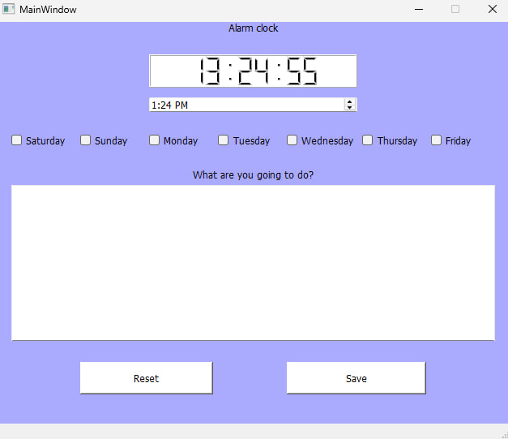

<<<<<<< HEAD
# ⏰ PyQt5 Alarm Clock

یک برنامه‌ی ساده و قدرتمند ساعت زنگ‌دار با رابط کاربری گرافیکی طراحی‌شده با **PyQt5**. این برنامه به شما امکان می‌دهد تا:
- زمان هشدار تنظیم کنید
- روزهای خاصی را برای فعال‌سازی آلارم انتخاب کنید
- یادداشت یا متن دلخواهی برای هشدار وارد کنید
- زمان فعلی ایران (Asia/Tehran) را به‌صورت دیجیتال مشاهده کنید

---

## 📷 تصویر از محیط برنامه



---

## 🚀 ویژگی‌ها

- [x] رابط گرافیکی کاربرپسند با PyQt5
- [x] پشتیبانی از ساعت ایران با `pytz`
- [x] ذخیره هشدارها در فایل `CSV`
- [x] امکان تنظیم هشدار برای روزهای خاص هفته
- [x] نمایش دیجیتالی ساعت (LCD Style)
- [x] قابلیت Reset فرم و حذف هشدار قبلی

---

## ⚙️ نحوه اجرا

1. ابتدا پکیج‌های لازم را نصب کنید:
```bash
pip install pyqt5 pytz jdatetime

=======
# alarm_clock
"Simple project to set alarm clock and task reminders"
>>>>>>> be0f6998ed909d7234529a96db809f7406cc128a
